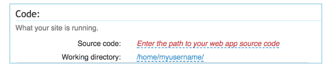
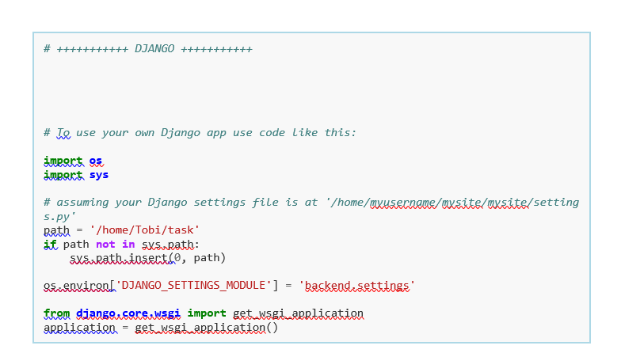
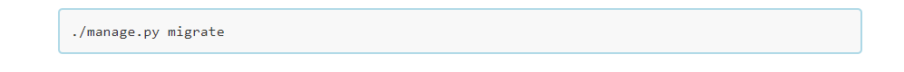

# NestIt Store - An Online store App!

## [](https://github.com/diddyjax19/NestIT-Phonestore--pp4#)[](readmeDocumentation/screenshots/responsive.png)

The NestIt Phone Store is  regular store where people can go to browse and order from a variety of phone and accesories.The store is open 24 hrs with staffs processing order to meet the clients need, it also as a place where customers can register and be part of the community to receive deals and promotions.Through the The NestIt store, users can check thier orders and the status of the delivery,they are also aware of where the good are coming from it.

A simple online market place built with the Django Framework using HTML, CSS and Javascript

This fictional site was created for Portfolio Project #4 (Full-Stack Toolkit) - Diploma in Full Stack Software Development Diploma at the [Code Institute](https://www.codeinstitute.net).

[View live website here](http://diddy.pythonanywhere.com/)

## [](https://github.com/diddyjax19/NestIT-Phonestore#toc)Table of Contents

# Table of contents

  * [Project goals](https://github.com/diddyjax19/NestIT-Phonestore#project-goals)
  * [UX](https://github.com/diddyjax19/NestIT-Phonestore#ux)
     * [User stories](https://github.com/diddyjax19/NestIT-Phonestore#user-stories)
  
  * [Features ](https://github.com/diddyjax19/NestIT-Phonestore#features)
      * [Navigation](https://github.com/diddyjax19/NestIT-Phonestore#navigation-bar)
      * [Home page](https://github.com/diddyjax19/NestIT-Phonestore#home-page)
      * [Registration page](https://github.com/diddyjax19/NestIT-Phonestore#registration-page)
      * [Log In / Log Out page](https://github.com/diddyjax19/NestIT-Phonestore#registration-page)
      * [Categories](https://github.com/diddyjax19/NestIT-Phonestore#recipe-library)
      * [About](https://github.com/diddyjax19/NestIT-Phonestore#about) 
      * [Contact](https://github.com/diddyjax19/NestIT-Phonestore#contact)
      * [Cart](https://github.com/diddyjax19/NestIT-Phonestore#cart)
      * [Profile](https://github.com/diddyjax19/NestIT-Phonestore#Profile)
      * [Orders](https://github.com/diddyjax19/NestIT-Phonestore#orders)
      * [Change Password](https://github.com/diddyjax19/NestIT-Phonestore#change-password)
    

  * [Design](https://github.com/diddyjax19/NestIT-Phonestore#design)
      * [Colours](https://github.com/diddyjax19/NestIT-Phonestore#colours)
      * [Typography](https://github.com/diddyjax19/NestIT-Phonestore#typography)
      * [Images](https://github.com/diddyjax19/NestIT-Phonestore#images)
      * [Wireframes](https://github.com/diddyjax19/NestIT-Phonestore#wireframes)
  * [Libraries And Installed Packages](https://github.com/diddyjax19/NestIT-Phonestore#libraries-and-installed-packages)
  * [Testing](https://github.com/diddyjax19/NestIT-Phonestore#testing)

  * [Deployment](#deployment) 
  * [Technologies Used](#technologies-used)
  * [Credit](#credits)

# Project Goals
***
The NestIt Phone Store is  regular store where people can go to browse and order from a variety of phone and accesories.The store is open 24 hrs with staffs processing order to meet the clients need, it also as a place where customers can register and be part of the community to receive deals and promotions. Through the The NestIt store, users can check thier orders and the status of the delivery,they are also aware of where the good are coming from.

# UX
***
 ## User Stories 
 ***

My Project was developed with agile planning. I had three columns: To Do, In Progress, and Done. This helps me to manage my project and helps me to be more flexible and adaptable to changes.
Below are the User stories that were used in creating this project. I add 8 EPIC with labels MUST, SHOULD-HAVE.

[Link for User stories](https://github.com/diddyjax19/NestIT-Phonestore--pp4/issues)

<details>
<summary>Click to see more</summary>

1 EPIC - Home Page and Navigation Bar

    * As a Site User I can easily navigate around the site so that I can view different pages. As a Site User, I want to see a home page with basic information about the app.
2 EPIC - Account registration 

    * As a Site User I want to be able to create an account and log in into my app with my username and password.

3 EPIC - Add CRUD functionality

    * As a Site User I want to browse the website. .
    * As a Site User I want to browse my categories.
    * As a Site User I want to update my cart.
    * As a Site User I want to delete cart from my cart page. 

4 EPIC - Categories Page 

   * As a Site User I want to be able to navigate the categories page,This page has an sub-section that houses all the categories and products that are on the website.

5 EPIC - About page
    
   * As a Site User I want to have a page where the user can read about the website and it founder.

6 EPIC - Contact Page

   * As a Site User I want to contact the website owner directly. In this Section the User can fil a form and leave a request.

7 EPIC - Cart Page 
   
   * As a Site User I want to be able view the products added to the cart,increase the quantity of the product,delete the product in the cart,view the shipping address before checkout and the various payment options available.

8 EPIC - Profile Page 
   
   * As a Site User I want to be able login to the website and be able to add new shipping address,view the address on file and view the orders on the website.

9 EPIC - Orders Page 
   
   * As a Site User I want to be able view all the orders placed on my account and thier respective status.

10 EPIC - Change Password Page 
   
   * As a Site User I want to be able to change my password.

11 EPIC - Create Account Page 
   
   * As a Site User I want to be able to create an account,with all the neccessary inofrmations.

12 EPIC - Log-in Page 
   
   * As a Site User I want to be able login to the website,with the right credentials .  


</details>

# Features  
  ***
<details>
<summary>Click to see more</summary>

 ## Navigation Bar

 

 * The navigation menu consists of Logo-text,Categories,About,contact, Log In and Create Account. By clicking on the Logo, the user can always return to the Home page. 
 If the User is new, he will have to register, and if the User already exists, he can easily Log In to his Nestit webpage. When the User login, some links on the navigation bar will change, and the user will be able to see the cart and My Account.

 

 * Also on the small screen the navigation menu will be changed to the burger menu which shows all the navigation links.

 


 ## Home Page
 

 * The home page has a welcome message and a short description of the application. At the bottom are three bright images of a recipe with the small guide on what users can do with this app.

 ## Registration page
  
 * Django allauth was installed and used to create the Sign-Up, Login, and Log Out functionality and pages

   * Sign UP

 * The user has to fill up the fields in the registration form: username, email, and password. If the User already exists they can click on the top page Sign In button, and will be transferred to the log-in form.
 
   
   * Log In

 * Log in form is similar to Sign up, only has a few fields username and a password. If the User forgotten to register as a new user,on the top of the Sign Up page there is a Sign Up link were the user can Sign Up. 
 

   * Success/unsuccess messages 

 * Success messages inform the user if they already have an account, enter the wrong password or username or enter the short password by creating a new account user.
 
 
 

 ## Categories 

 * This is the main page where all created categories are saved. Under each category is the title of the manufacturer of the phone.

 


 * By clicking on the image of the category, the user will be see all the phones avaliable from that manufacturer.

 

 * At selecting the phone he is then redirected to the product description.In this section the user can view all the specification and the price.In this section the user is able to get see a  complete detail of the product and also see similar products.

 

 

 

   * About Us Page

 * This section tell the user a brief description of the website and a hiistory of the website.

 

   * Contact Page

 * In this section,the user has the opportunity to contact us directly or reach out to make enquiry.

 

   * Cart Page

 * Under this Section you can see the products added to the cart,you can see the shippping address that are on your profile,you can also see a button that redirect you to continue shopping and also all the payment option available.
   
 
 
    
 ## My Account

 

 * Profile

 * Under this page you will find the shipping address and all the items and their status.It also gives the user the ability to add address.

 

 * Cart

 * Under this Section you can see the products added to the cart,you can see the shippping address that are on your profile,you can also see a button that redirect you to continue shopping and also all the payment option available.
   
 
 


 * Orders

 * In this section,the user can see all the orders they have placed under their account,it shows the product name,the picture of the product,the quantity of product placed,the date the order was placed, and the current status of the order {completed,accepted,cancelled,delivered and pending}.

 

 * Change Password 

 * In this section,the user can reset his password.

 


</details>

 # Design 
  ***
## Colours

 

  * The colour scheme was chosen by the background image of the project. I used black for the footer and white for the background.

## Typography

* The font chosen for the website is a font called "Libre Franklin", sans-serif. I used this font because Merriweather font is ideal for text-dense design: the letterforms have a tall x-height but remain relatively small, making for excellent readability across screen sizes while not occupying extra horizontal space. The font was found on [Google Font](https://fonts.google.com/) and imported to the website through a CSS import.

## Images

* All images were all taken from [Pexels](https://www.pexels.com/ru-ru/). 

## Wireframes

[Link to wireframes](https://github.com/Aliona83/project4--test/tree/main/readmeDocumentation/wireframes)

# Libraries And Installed Packages
***
  * Django -crispy-forms - Used to render forms throughout the project.
  * Django - allauth - Allows authentication, registration and account management in Django.
  * django-environ - is the Python package that allows you to use Twelve-factor methodology to configure your Django application with environment variables.
  * mySqlclient - Python interface to MySQL.
  * sqlparse - sqlparse is a non-validating SQL parser for Python. It provides support for parsing, splitting and formatting SQL statements. 
  * pytz - This library allows accurate and cross platform timezone calculations using Python 2.4 or higher.
  * PyNaCl -PyNaCl is a Python binding to libsodium, which is a fork of the Networking and Cryptography library. 
  * pycparser- pycparser is a complete parser of the C language, written in pure Python using the PLY parsing library. It parses C code into an AST and can serve as a front-end for C compilers or analysis tools.
  * Pillow -The Python Imaging Library adds image processing capabilities to your Python interpreter.
  * Paramiko -Paramiko is a pure-Python 1 (3.6+) implementation of the SSHv2 protocol 2, providing both client and server functionality. It provides the foundation for the high-level SSH library Fabric, which is what we recommend you use for common client use-cases such as running remote shell commands or transferring files.
  * bcrypt - Acceptable password hashing for your software and your servers
  * Asgiref - ASGI is a standard for Python asynchronous web apps and servers to communicate with each other, and positioned as an asynchronous successor to WSGI.
  * Cryptography - A set of primitives for easily encrypting data in Django, wrapping the Python Cryptography library
  * cffi - C Foreign Function Interface for Python. Interact with almost any C code from Python, based on C-like declarations that you can often copy-paste from header files or documentation.
  * sshtunnel- establishes a connection between a port on the local machine and a main node in HDInsight 


# Testing 
***

Details of all testing done can be viewed in depth in the 

[Link to TESTING.md](https://github.com/diddyjax19/NestIT-Phonestore--pp4/blob/main/TESTING.md) document.

 ## [](https://github.com/diddyjax19/NestIT-Phonestore--pp4#deployment)Deployment

### [](https://github.com/diddyjax19/NestIT-Phonestore--pp4#forking-the-github-repository)Forking the GitHub Repository

1.  Go to [the project repository](https://github.com/diddyjax19/Taskit-FrontEnd)
2.  In the right most top menu, click the "Fork" button.
3.  There will now be a copy of the repository in your own GitHub account.

### [](https://github.com/diddyjax19/NestIT-Phonestore--pp4#running-the-project-locally)Running the project locally

1.  Go to [the project repository](https://github.com/diddyjax19/Taskit-FrontEnd)
2.  Click on the "Code" button.
3.  Choose one of the three options (HTTPS, SSH or GitHub CLI) and then click copy.
4.  Open the terminal in you IDE program.
5.  Type `git clone` and paste the URL that was copied in step 3.
6.  Press Enter and the local clone will be created.

### [](https://github.com/diddyjax19/NestIT-Phonestore--pp4#alternatively-by-using-gitpod)Alternatively by using Gitpod:

1.  Go to [the project repository](https://github.com/diddyjax19/Taskit-FrontEnd)
2.  Click the green button that says "Gitpod" and the project will now open up in Gitpod.

### Manual Deplyoment In Python Anywhere:

1. - Uploading your code to PythonAnywhere
    Assuming your code is already on a code sharing site like GitHub or Bitbucket, you can just clone it from a Bash Console:


2. Create a virtualenv and install Django and any other requirements
    In your Bash console, create a virtualenv, naming it after your project, and choosing the version of Python you want to use:


  Warning: Django may take a long time to install. PythonAnywhere has very fast internet, but the filesystem access can be slow, 
  and Django creates a lot of small files during its installation. Thankfully you only have to do it once!

TIP: if you see an error saying mkvirtualenv: command not found, check out InstallingVirtualenvWrapper.

3. Setting up your Web app and WSGI file
    At this point, you need to be armed with 3 pieces of information:

  The path to your Django project's top folder -- the folder that contains "manage.py", eg /home/myusername/mysite
  The name of your project (that's the name of the folder that contains your settings.py), eg mysite
  The name of your virtualenv, eg mysite-virtualenv
  Create a Web app with Manual Config
  Head over to the Web tab and create a new web app, choosing the "Manual Configuration" option and the right version of Python (the same one you used to create your virtualenv).


4. NOTE: Make sure you choose Manual Configuration, not the "Django" option, that's for new projects only.
    Enter your virtualenv name
    Once that's done, enter the name of your virtualenv in the Virtualenv section on the web tab and click OK.


5. You can just use its short name "mysite-virtualenv", and it will automatically complete to its full path in /home/username/.virtualenvs.

    Optional: enter path to your code
    Although this isn't necessary for the app to work, you can optionally set your working directory and give yourself a convenient hyperlink to your source files from the web tab.

    Enter the path to your project folder in the Code section on the web tab, eg /home/myusername/mysite in Source code and Working directory



6. Edit your WSGI file
    One thing that's important here: your Django project (if you're using a recent version of Django) will have a file inside it called wsgi.py. This is not the one you need to change to set things up on PythonAnywhere -- the system here ignores that file.

    Instead, the WSGI file to change is the one that has a link inside the "Code" section of the Web tab -- it will have a name something like /var/www/yourusername_pythonanywhere_com_wsgi.py or /var/www/www_yourdomain_com_wsgi.py.

    Click on the WSGI file link, and it will take you to an editor where you can change it.

    Delete everything except the Django section and then uncomment that section. Your WSGI file should look something like this:



7. Be sure to substitute the correct path to your project, the folder that contains manage.py, which you noted above.
    Don't forget to substitute in your own username too!
    * Also make sure you put the correct value for DJANGO_SETTINGS_MODULE.
    * This guide assumes you're using a recent version of Django, so leave the old wsgi.WSGIHandler() code commented out, or better still, delete it.
  
8. Save the file, then go and hit the Reload button for your domain. (You'll find one at the top right of the wsgi file editor, or you can go back to the main web tab).

9. Database setup
    If, like most sites, your site uses a database, you'll need to set that up. Go to the Consoles tab, start a bash console, use cd to navigate to the directory where your Django project's manage.py lives, then run.



# How to start Using MySQL.
To start using MySQL, you'll need to go to the MySQL tab on your dashboard, and set up a password. You'll also find the connection settings (host name, username) on that tab, as well as the ability to create new databases.

You can start a new MySQL console to access your databases from this tab too, or alternatively you can open a MySQL shell with the following command from a bash console or ssh session:

`mysql -u USERNAME -h HOSTNAME -p 'USERNAME$DATABASENAME'`
In this:

The USERNAME is the username you use to log in to PythonAnywhere
The HOSTNAME is on your Databases tab
The 'USERNAME$DATABASENAME' is the full name of your database, which comprises your username, then a dollar sign, then the name you gave it. The single quotes around it are important! If you don't put them in there, bash will try to interpret the $DATABASENAME as an environment variable, which will lead to an error saying ERROR 1044 (42000): Access denied for user 'USERNAME'@'%' to database 'USERNAME'
When you run the command, it will prompt you for a password -- use the one you entered on the Databases tab.

Accessing MySQL from Python

The appropriate libraries are installed for all versions of Python that are supported, so if you're not using a virtualenv, to access a MySQL database just import MySQLdb.

If you are using a virtualenv, you'll need to install the correct package yourself. Start a bash console inside the virtualenv, then:

For Python 3.x

`pip install mysqlclient`

### MySQL with Django
To configure Django to access a MySQL database on PythonAnywhere, you need to do this in your settings file:

```
DATABASES = {
    'default': {
        'ENGINE': 'django.db.backends.mysql',
        'NAME': '<your_username>$<your_database_name>',
        'USER': '<your_username>',
        'PASSWORD': '<your_mysql_password>',
        'HOST': '<your_mysql_hostname>',
    }
}

```
Again, you can get the username and hostname details from the "Databases" tab.

### MySQL with Django tests
When you run Django tests that use the database, Django tries to create a database called `test_<original database name>` and that will fail because Django does not have permissions to create a new database. To run Django tests on PythonAnywhere, add a TEST key to your database definition in settings.py. Like this:

```
DATABASES = {
    'default': {
         ...
        'TEST': {
          'NAME': '<your username>$test_<your database name>',

```
[More info here:](https://docs.djangoproject.com/en/3.2/ref/settings/#test)

We suggest you use a form like `<your username>$test_<your database name>`. Create this database from the PythonAnywhere Databases tab and Django will happily use it and run your tests.

## how to Access your MySQL database from outside PythonAnywhere
There are a number of ways to do this. The first thing to know is the SSH hostname for your account:

If the account is on the global, US-based system at www.pythonanywhere.com, then the SSH hostname is ssh.pythonanywhere.com
If the account is on the EU-based system at eu.pythonanywhere.com, then the SSH hostname is ssh.eu.pythonanywhere.com
Note the difference in hostnames for both SSH and MySQL:

Hostname	
Global-US:	ssh.pythonanywhere.com	username.mysql.pythonanywhere-services.com
EU:	ssh.eu.pythonanywhere.com	username.mysql.eu.pythonanywhere-services.com

SSH	MySQL
Global-US: username.mysql.pythonanywhere-services.com
EU:	username.mysql.eu.pythonanywhere-services.com

### From Django
If running the project on your local machine, and you want it to access your MySQL database, you can install the sshtunnel package (`pip install sshtunnel`)and then use code like this:

1. In the django settings.py create an ssh tunnel before the django DB settings block:
```
from sshtunnel import SSHTunnelForwarder

# connect to a server uisng ssh username and password
server = SSHTunnelForwarder(
    'SERVER_IP',
    ssh_username="SSH_USERNAME",
    ssh_password="SSH_PASSWORD",
    remote_bind_address=('your database hostname', 3306)
)

server.start()

print(server.local_bind_port)  # show assigned local port
# work with `SECRET SERVICE` through `server.local_bind_port`.

```
2. Then add the Database info block in the settings.py. Here I am adding a default local mySQLite DB and the remote MySQL DB that we connect to using the ssh tunnel

```
DATABASES = {
    'default': {
        'ENGINE': 'django.db.backends.sqlite3',
        'NAME': BASE_DIR / 'db.sqlite3',
    },
    'server_db': {
        'ENGINE': 'django.contrib.gis.db.backends.postgis',
        'HOST': 'localhost',
        'PORT': server.local_bind_port,
        'NAME': REMOTE_DB_DB_NAME,
        'USER': REMOTE_DB_USERNAME,
        'PASSWORD': REMOTE_DB_PASSWORD,
    },
}
```
3. Executions like make migratations can be made to the remote db using commands like `$ python manage.py migrate --database=server_db` or make calls to the db from within the python code using lines like Models.objects.all().using('shhtunnel_db')


# How to set up environment variables in Django for security
It is important to keep sensitive bits of code like API keys and passwords away from the public.

1. Install Django Environ
In your terminal, inside the project directory, type:

`$ pip install django-environ`

2. Import environ in settings.py
`import environ`

3. Initialise environ
Below your import in settings.py:

```
    #Initialise environment variables
    env = environ.Env()
    environ.Env.read_env()
```

4. Create your .env file
In the same directory as settings.py, create a file called `.env`

5. Declare your environment variables in .env
Make sure you don’t use quotations around strings.

    SECRET_KEY=h^z13$qr_s_wd65@gnj7a=xs7t05$w7q8!x_8zsld#
    DATABASE_NAME=mysql
    DATABASE_USER=bob
    DATABASE_PASS=supersecretpassword

6. IMPORTANT: Add your .env file to .gitignore
If you don’t have a .gitignore file already, create one at the project root. Make sure the name of your .env file is included.

7. Replace all references to your environment variables in settings.py, like so

```
DATABASES = {
‘default’: {
‘ENGINE’: ‘django.db.backends.mysql’,
‘NAME’: env(‘DATABASE_NAME’),
‘USER’: env(‘DATABASE_USERNAME’),
‘PASSWORD’: env(‘DATABASE_PASSWORD’),
}
}
```
And

`SECRET_KEY = env(‘SECRET_KEY’)`

## Migrating the database from SQLite to MySQL

1. Verify database by running `python manage.py dbshell`
2.  Backup data`python manage.py dumpdata > mydb.json `
3.  Create a new database on my pythonanywhere
4. Add my Sql database settings to settings file :
``` DATABASES = {
        'default': {
            'ENGINE': 'django.db.backends.mysql',
            'NAME': env('DATABASE_NAME'),
            'USER': env('DATABASE_USER'),
            'PASSWORD': env('DATABASE_PASSWORD'),
            'HOST': '127.0.0.1',   # Or an IP Address that your DB is hosted on
            'PORT': '3306',
        }
    }
 ```
 5. Run `python manange.py migrate`
 6. Run `python manage.py loaddata 'mydb.json'`


# Technologies Used

* [GitHub](https://github.com/Aliona83/project4--test) - is Used in conjunction with Gitpod as the code editor, to store the project and utilise git version control.
* [Heroku](https://dashboard.heroku.com/apps/project4-recipe/deploy/github) -  Used to deploy and host the finished product.
* [Cloudinary](https://cloudinary.com/ip/gr-sea-gg-brand-home-base?utm_source=google&utm_medium=search&utm_campaign=goog_selfserve_brand_wk22_replicate_core_branded_keyword&utm_term=1329&campaignid=17601148700&adgroupid=141182782954&keyword=cloudinary&device=c&matchtype=e&adposition=&gad=1&gclid=CjwKCAjwhdWkBhBZEiwA1ibLmOvYU6owOOD0_4WV0wjEeSKAO26vKCB4t7DVKWyjJLhud_3K3Y0DFRoCQBIQAvD_BwE) -  Used as cloud-based storage, storing any submitted media in the deployed application.
* [ElephantSQ](https://customer.elephantsql.com/login) - Used to host the PostgreSQL database for the application.
* [W3C](https://validator.w3.org/) - HTML Used to validate all HTML code.
* [W3C](https://jigsaw.w3.org/css-validator/) - CSS Used to validate all CSS code.
* [CI PEP8](https://pep8ci.herokuapp.com/) -  Testing Used to validate all Python code.
* [Google Fonts](https://fonts.google.com/) - Used to provide the fonts used in application styling.
* [Bootstrap](https://getbootstrap.com/docs/5.0/getting-started/introduction/) - Used to aid the implementation of styling and responsiveness.
* [Fontawesome](https://fontawesome.com/) - is Used to implement effective icons.
* Google Chrome Dev Tools -  Used during the development to debug and test responsiveness.
* [Balsamiq](https://balsamiq.com/wireframes/?gad=1&gclid=CjwKCAjwhdWkBhBZEiwA1ibLmBf4umD1_GJ4rfxmLez1jQMyL3j_-olvsWrn5Rgxvvae-sQbboRbaRoC-eAQAvD_BwE) - Used to build both the database schema diagram and design wireframes.
* [Pexel](https://www.pexels.com/search/free/) - All mages were taken from this website.
* [Color palette](https://coolors.co/) - Select colors for website.
* [Ax Dev Tools](https://chrome.google.com/webstore/detail/axe-devtools-web-accessib/lhdoppojpmngadmnindnejefpokejbdd) - Find and fix more accessibility issues during website development with axe DevTools. 
     
# Credits    
* [Stack Overflow](https://try.stackoverflow.co/explore-teams/?utm_source=adwords&utm_medium=ppc&utm_campaign=kb_teams_search_brand_emea-dach&_bt=657236278309&_bk=stack+overflow&_bm=p&_bn=g&gclid=CjwKCAjwhdWkBhBZEiwA1ibLmF2ghGSQXiKfjiQcnpRL_87pacwew2yt-jYDV9_z56sxtUF-BMthsRoCB7oQAvD_BwE)
* [BBC good food](https://www.bbcgoodfood.com/)
* [Codemy.com](https://www.youtube.com/watch?v=B40bteAMM_M&list=PLCC34OHNcOtr025c1kHSPrnP18YPB-NFi) 
* [Django documentation](https://docs.djangoproject.com/en/4.2/)
* [LinkedIn Learning](https://www.linkedin.com/learning/paths/become-a-django-developer)
* [E-commerce website with django](https://www.youtube.com/watch?v=YZvRrldjf1Y)
* [Codecademy](https://www.codecademy.com/?g_network=g&g_productchannel=&g_adid=528849219280&g_locinterest=&g_keyword=codecademy&g_acctid=243-039-7011&g_adtype=&g_keywordid=kwd-41065460761&g_ifcreative=&g_campaign=account&g_locphysical=1007835&g_adgroupid=70492864474&g_productid=&g_source={sourceid}&g_merchantid=&g_placement=&g_partition=&g_campaignid=1726903838&g_ifproduct=&utm_id=t_kwd-41065460761:ag_70492864474:cp_1726903838:n_g:d_c&utm_source=google&utm_medium=paid-search&utm_term=codecademy&utm_campaign=INTL_Brand_Exact&utm_content=528849219280&g_adtype=search&g_acctid=243-039-7011&)