# Table of Contents
 * [Validator Testing](#validator-testing)
   * [HTML](#html-validator)
   * [CSS](#css-validator)
   * [PYTHON](#python)
   * [LIGHTHOUSE](#lighthouse)
   * [GTMETRIX](#gtmetrix)
  
 * [Device Testing](#device-testing)
 * [Manual Testing](#manual-testing)
 * [Bugs](#bugs)

# Validator Testing

Click to see more

  ## HTML Validator

  * Home Page
    
    * Add recipe page
    
    * Recipe Library
    
    * Each Recipe Page
    
    * Update Recipe page
    
    * Log In
    
    * Log Out
    
    * Register page
    

 ## CSS Validator

  * Css 
  

  ## Python

 Add_recipe folder 
 All available files have been checked
  * form.py
  
  * model.py
  
  * url.py
  

  project4 folder
   * url.py
   
  
  recipe folder
    * url.py
    
    * view.py
    

## Lighthouse

Click to see more

 * Home Page
     * Desktop
  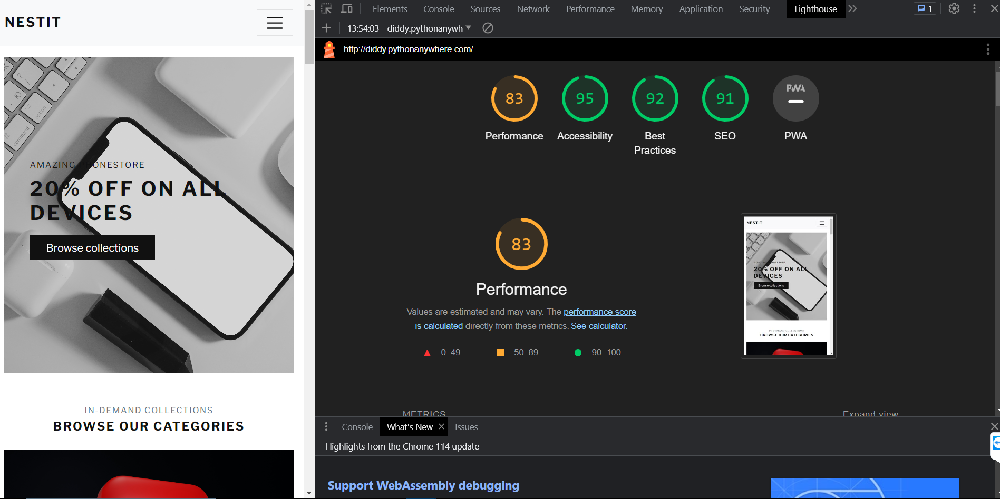
     * Mobile
  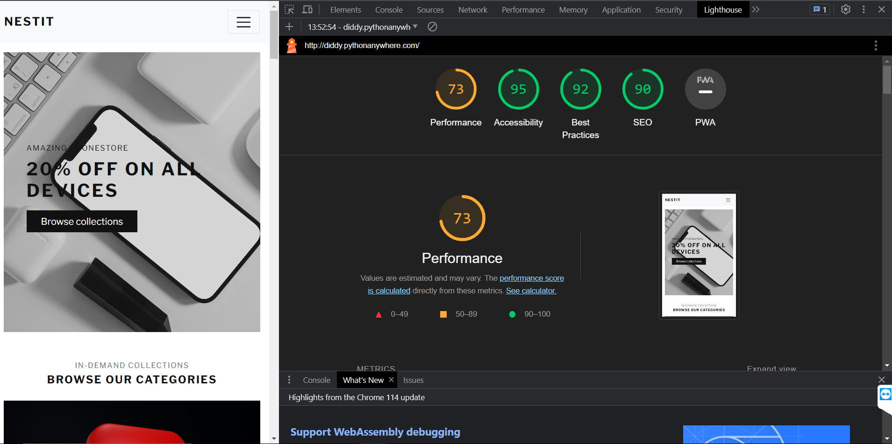
 
 * Categories
    * Desktop
  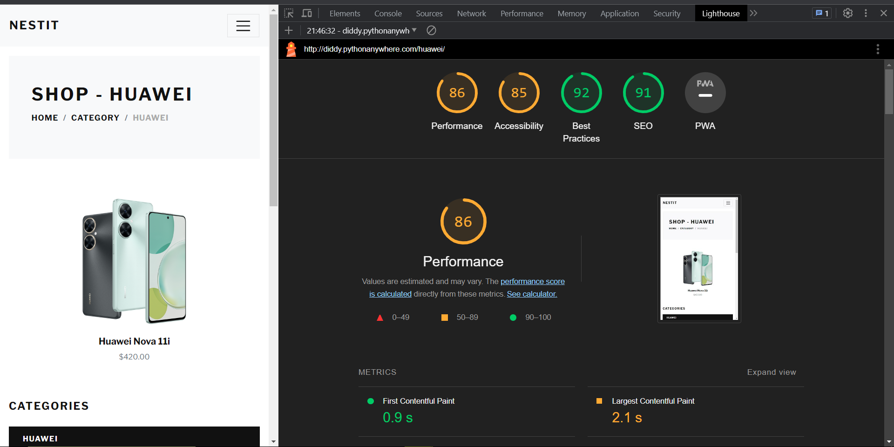
    * Mobile
  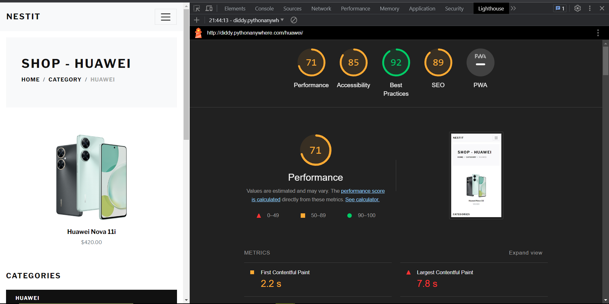
   

  * About 
    * Desktop
 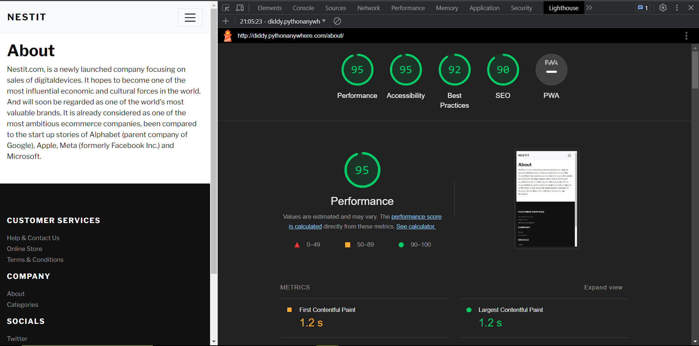
     * Mobile
 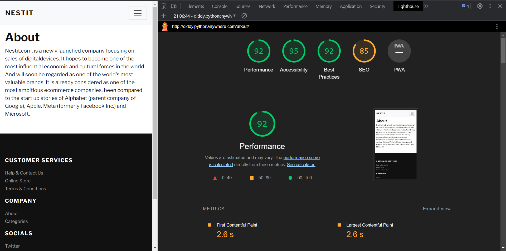

  * Contact Page 
     * Desktop
  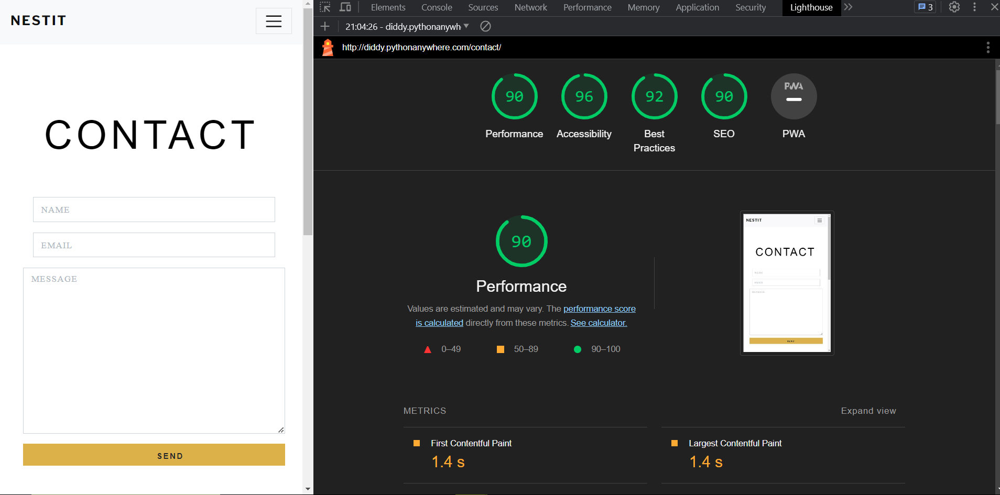
     * Mobile
  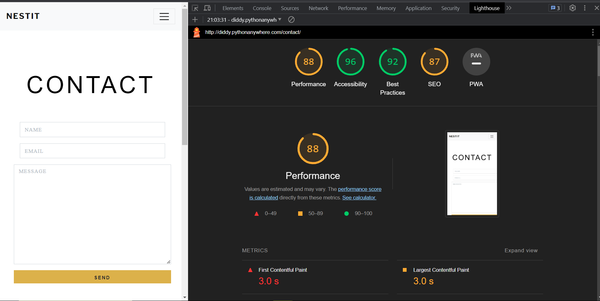

  
  * Cart Page
 * Desktop
  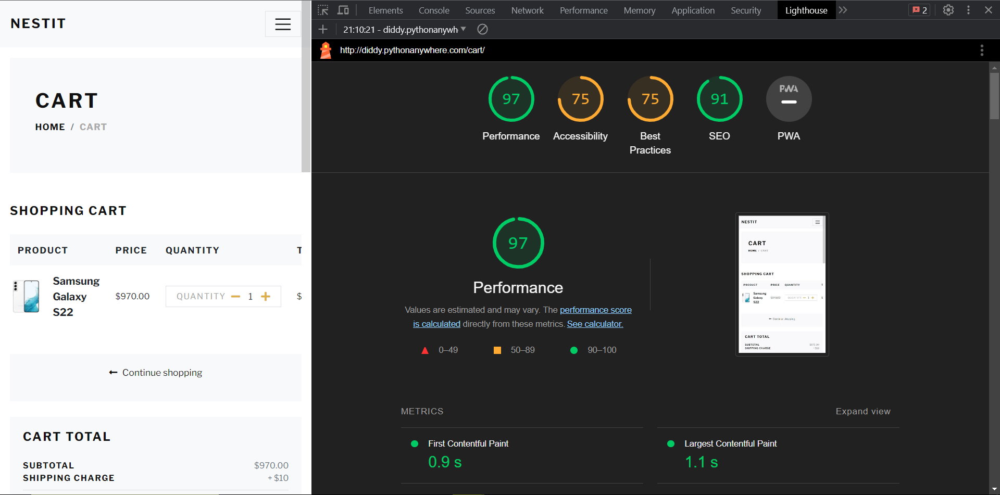
    * Mobile
  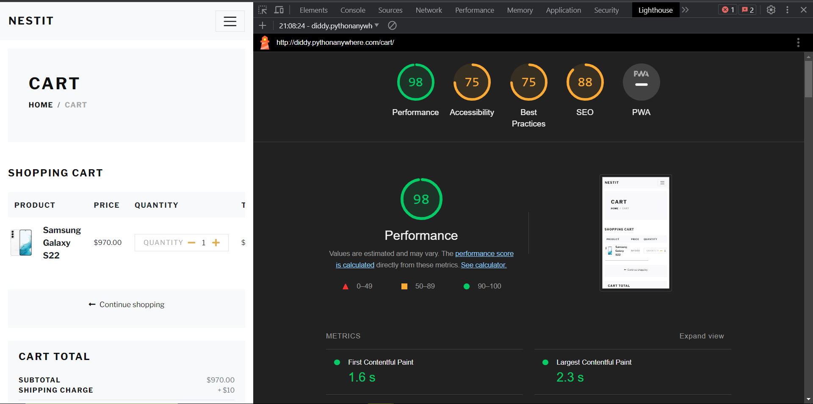

  
  * Profile
  * Desktop
  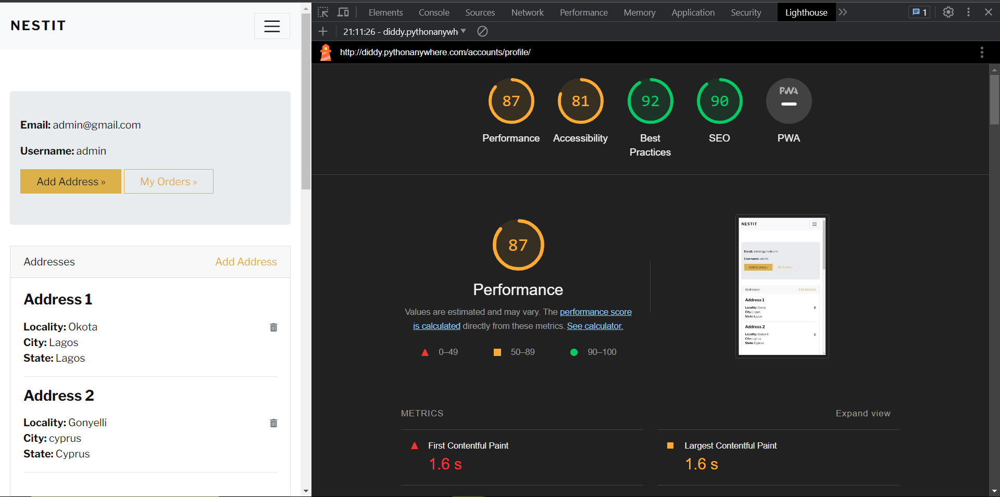
    * Mobile
  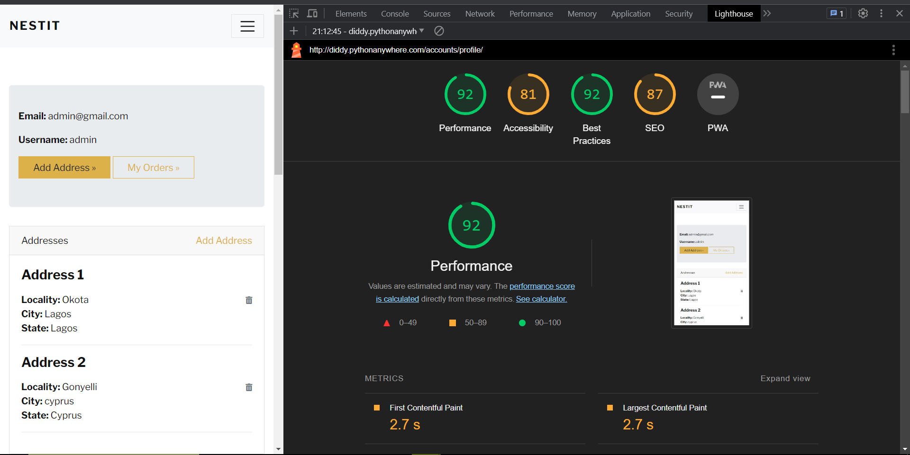

   * Orders
 * Desktop
  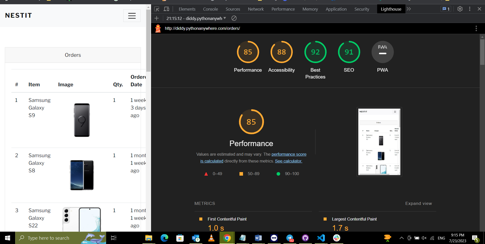
    * Mobile
  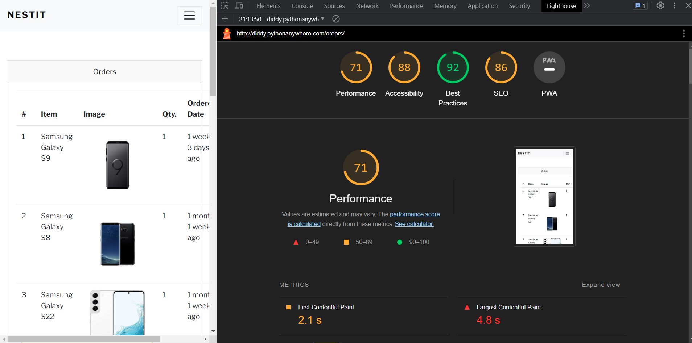

   * Change Password Page
  * Desktop
  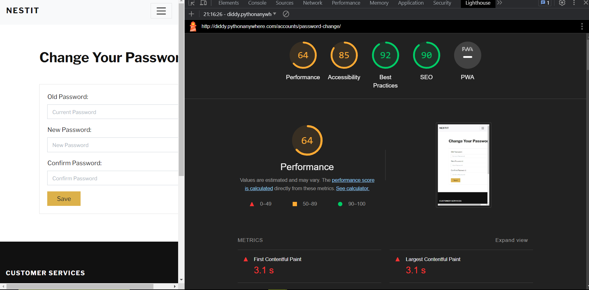
    * Mobile
  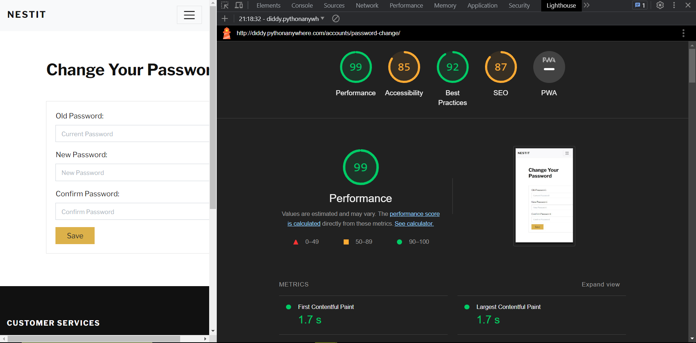

   * SignUp Page 
    * Desktop
  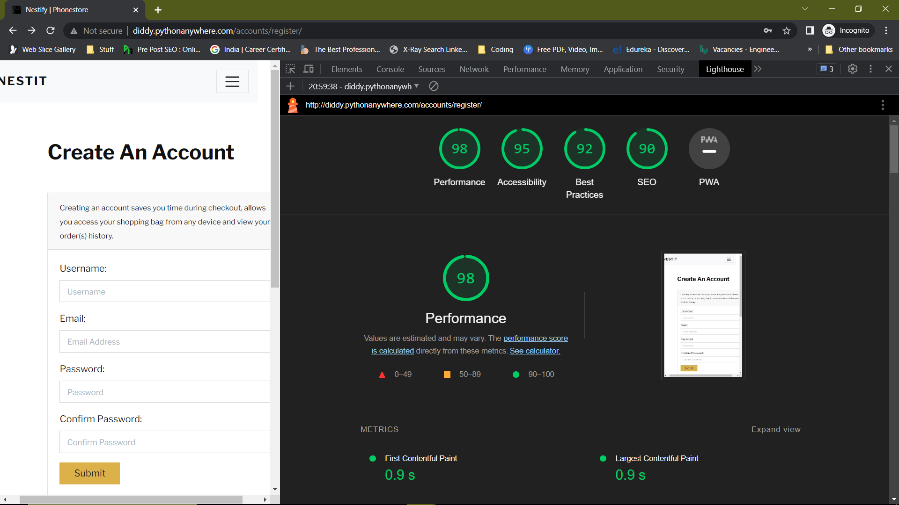
    * Mobile
  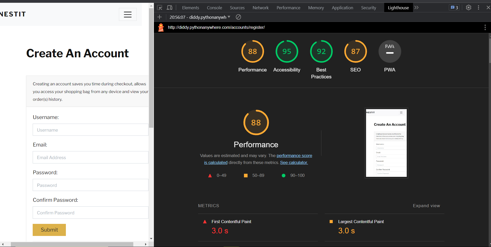

  * LogIn Page
 * Desktop
  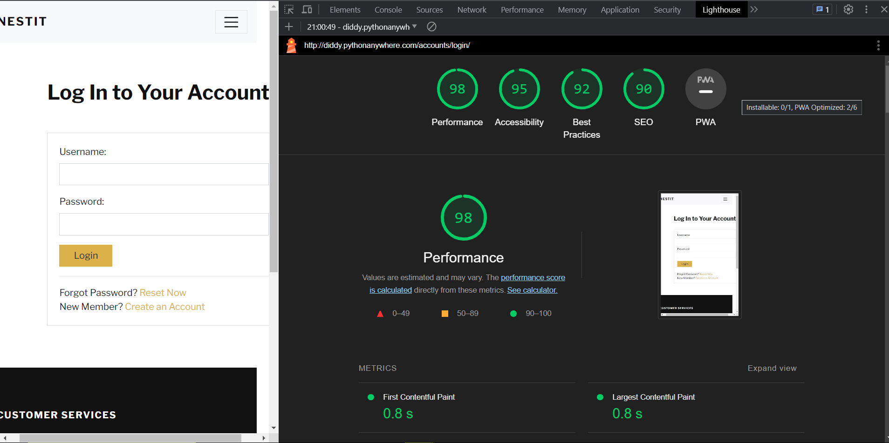
    * Mobile
  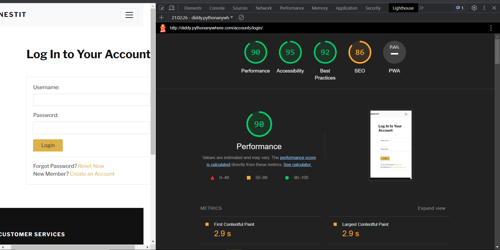

  

   ## GTMETRIX 
   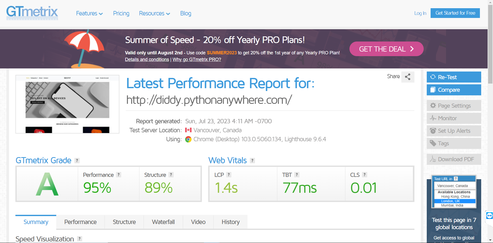

  

    # Device Testing
     ***

     The project has been checked on these devices :
       
    * iMac 
    * iPad Apple
    * MacBook Pro
    * Samsung Galaxy Tablet
    * Iphone 6
    * Iphone 11
    * Chrome
    * Firefox
    
    On all these devices the project worked perfectly, and no errors were detected.

   # Manual Testing

Click to see more

| Feature       |           Test Performed    |             Result           |        
|:--------------|:--------------------------- |:---------------------------  |
|                        Navigation                                        |
| Logo          | Clicked on Logo to check or redirect to the home page| Pass |
| Home button   | Clicked on the Home button from different pages to check or redirect to the home page| Pass  | 
| Categories   | Clicked on the categories and was redirected to the categories section | Pass |
| Sign-Up     | When clicking on the Sign-Up link, brings the User to the registration page | Pass |
| Small screens |  Checked that on smaller devices changes to the burger menu | Pass |
| About US      | Clicked About US and was redirected to the page with brief info on the | Pass | 
| Log In        | Clicked on the log-in link that will bring the User to the login page  | Pass |
| Log Out       | Clicked on the log-out link that will bring the User to log out page | Pass |
|                                                         Footer                      |
| Small screens |       Checked that all media links are visible on small devices | Pass |                                |
| Media  Links  | Clicked on each media link opens a new page   | Pass |
| Footer is on all pages      | Check all pages how the footer looks   | Pass |
|                    Categories Page                     |
| Categories Page| For this test, I want to make sure that when you clicked the full menu of all categories.|Pass |
| View form on different sizes of devices | Check how will look categories form on tablets and phones, make sure all form fields are easy to see and use| Pass. |
| Save new recipe | Recipe was successfully saved with the image. and I filled out all the fields| Pass|
|                         About  Page                     |
| About Page| For this test, I want to make sure that when you clicked the About link.|Pass |
| View form on different sizes of devices | Check how will look categories form on tablets and phones, make sure all form fields are easy to see and use| Pass. |

|                         Contact  Page                     |
| Contact Page| For this test, I want to make sure that when you clicked the Contact link.|Pass |
| View form on different sizes of devices | Check how will look categories form on tablets and phones, make sure all form fields are easy to see and use| Pass. |

|                        Cart Page                     |
| Contact Page| For this test, I want to make sure that when you clicked the Contact link.|Pass |
| View form on different sizes of devices | Check how will look categories form on tablets and phones, make sure all form fields are easy to see and use| Pass. |

|                         Profile Page                     |
| Profile Page| For this test, I want to make sure that when you clicked the Profile link.|Pass |
| Add Address | For this test, I want to make sure that when you clicked on add address they are directed to another Page.|Pass |
| Delete Address| For this test, I want to make sure that when you an address it stays deleted.|Pass |
| Address form| For this test, I want to make sure that when the user has fill his address and all the neccessary area,the changes are able to save and update in the profile page.|Pass |
| View form on different sizes of devices | Check how will look categories form on tablets and phones, make sure all form fields are easy to see and use| Pass. |

|                         Orders                    |
| Orders Page| For this test, I want to make sure that when you clicked the Orders link.|Pass |
| View form on different sizes of devices | Check how will look Order form on tablets and phones, make sure all form fields are easy to see and use| Pass. |

|                         Change Password                     |
| Change Password Page| For this test, I want to make sure that when you clicked the Change Password link.|Pass |
| Changing the password | This check was to verify that after trying the current password and typing the new password twice the User can save this changes. |Pass |
| View form on different sizes of devices | Check how will look Change password form on tablets and phones, make sure all form fields are easy to see and use| Pass. |

# Bugs 
***

| Bug      |       What  Issue   |       How   Issue     Fixed      |        
|:--------------|:--------------------------- |:---------------------------  |
| Wrong Url path| When I click create recipe was redirecting to add recipe page | Issue fixed by changing right URL path |
| Couldn't see any add recipes in all_recipe page | Page was empty whit out any recipes | Issue was wrong spell object variable this had issue by iterate through the list of objects| 
| Page not found (404)
No recipes match the given query| When I want to like recipe get error no recipes match query | Fixed issue by check the query parameters|
| DisallowedHost at /add _recipe| During the work on the project changed frequently HTTP_HOST header | Was adding the right HTTP_HOST header to ALLOWED_HOSTS|
| Success message | After the user log in or log out success massage appeared on page all_recipes | Move to display messages tag from all_recipes to base.html file|
| Like button | Issue was that when I like one recipe I liked all recipes what was on that page | Made decision to move the like button from all_recipes to each recipe and like each recipe separately|

## Unfix Bugs 
There are no unfixed bugs.